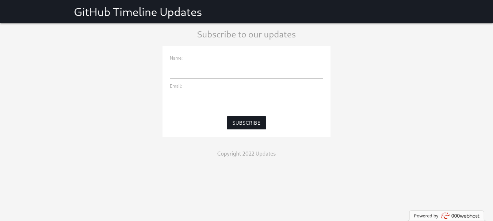

# github-timeline

A web-app which let you subscribe and get notified for github-timelines.

## How to use

<!-- how to use -->

1. Go to [github-timeline](http://githubtimeline.ml/)
2. Enter name and email address to which you want to recieve updates to
3. Click on `SUBSCRIBE`
4. You will recieve github-timeline updates right at your email address.

## Screenshots

## Tech Stack

### XAMPP

> Used by me in this project: `(Apache, MySQL, PHP)`

-   X - XAMPP is an easy to install Apache distribution containing MariaDB, PHP, and Perl.
-   A - Apache is the world's most used web server software.
-   M - MySQL is the world's most popular open source database.
-   P - PHP is a popular general-purpose scripting language that is especially suited to web development.
-   P - Perl is a family of high-level, general-purpose, interpreted, dynamic programming languages.

## References

-   [Sending email with PHPMailer](https://stackoverflow.com/questions/44872078/sending-emails-with-phpmailer)
-   [Configuring Apache](https://wiki.archlinux.org/title/XAMPP)
